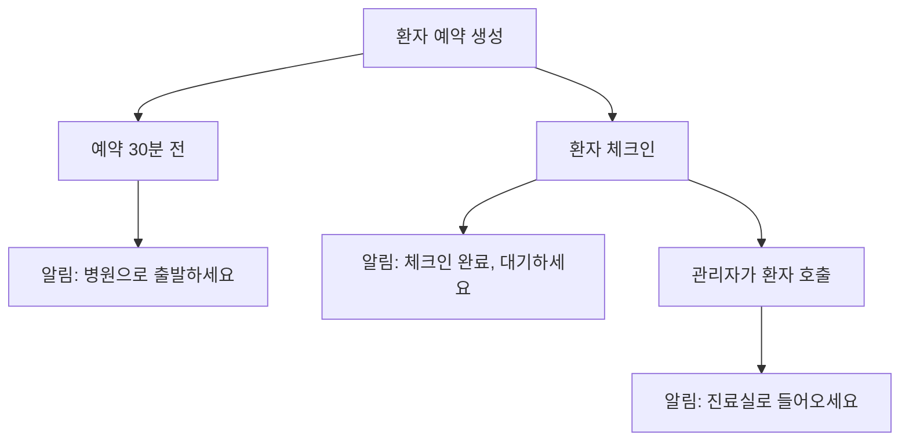

# CareFreePass API 명세서 📚

## 📋 개요

CareFreePass 병원 예약 시스템의 API 명세서 모음입니다.  
개발 목적과 사용 주체에 따라 3개 파일로 분리되어 있습니다.

**Base URL**: `http://13.124.250.98:8080`  
**Swagger UI**: `http://13.124.250.98:8080/swagger-ui/index.html`

---

## 📁 명세서 구성

### 🖥️ [웹 관리자용 API 명세서](./웹_관리자용_API_명세서.md)
**대상**: 병원 관리자 웹 대시보드 개발자  
**주요 기능**:
- 병원 관리자 인증 (회원가입/로그인)
- 대기 환자 관리 (목록 조회/호출)
- 예약 관리 (상태 변경/삭제)
- 진료과 관리 (생성/수정/삭제)
- 시간대 차단 관리
- 알림 이력 조회

### 📱 [모바일 환자용 API 명세서](./모바일_환자용_API_명세서.md)
**대상**: 환자용 모바일 앱 개발자 (iOS/Android)  
**주요 기능**:
- 환자 인증 (회원가입/로그인)
- AI 채팅 상담 (증상 분석/진료과 추천)
- 예약 시간 조회 (가능 시간대 확인)
- 예약 생성 및 체크인
- FCM 푸시 알림 수신

### 🔗 [공통 API 명세서](./공통_API_명세서.md)
**대상**: 웹/모바일 공통 개발자  
**주요 기능**:
- JWT 토큰 재발급
- 서버 헬스체크 및 테스트
- 공통 예약 수정 API
- 에러 응답 규격
- 보안 및 인증 가이드

---

## 🎯 사용법 가이드

### 🖥️ 웹 관리자 개발자라면
1. [웹 관리자용 API 명세서](./웹_관리자용_API_명세서.md) **필독**
2. [공통 API 명세서](./공통_API_명세서.md) **참고**
3. 모바일용 명세서는 **선택사항**

### 📱 모바일 앱 개발자라면  
1. [모바일 환자용 API 명세서](./모바일_환자용_API_명세서.md) **필독**
2. [공통 API 명세서](./공통_API_명세서.md) **참고**
3. 웹용 명세서는 **선택사항**

### 🔧 풀스택 개발자라면
1. **모든 명세서 필독** ✨
2. 특히 [공통 API 명세서](./공통_API_명세서.md)의 에러 처리 가이드 참고

---

## 📊 API 요약 통계

| 구분 | 엔드포인트 수 | 주요 기능 |
|------|---------------|-----------|
| **웹 관리자용** | 18개 | 환자 관리, 예약 관리, 진료과 관리, 시간대 관리 |
| **모바일 환자용** | 12개 | 환자 인증, AI 상담, 예약 생성/조회, 체크인 |
| **공통** | 3개 | 토큰 재발급, 헬스체크, 공통 수정 API |
| **총합** | **33개** | REST API 32개 + WebSocket 1개 |

---

## 🔐 인증 시스템 개요

### JWT 토큰 기반 인증
- **Access Token**: 1시간 유효, API 호출시 사용
- **Refresh Token**: 14일 유효, Access Token 재발급용
- **역할 구분**: `PATIENT` (환자) / `HOSPITAL` (관리자)

### 현재 보안 설정
- **개발 환경**: 인증 없이 접근 가능 ⚠️
- **운영 환경**: JWT 토큰 필수 (향후 적용 예정) 🔒

---

## 📱 권장 개발 플로우

### 🖥️ 웹 관리자 대시보드
```
1. 관리자 로그인
2. 실시간 대기 환자 목록 표시
3. 환자 호출 기능
4. 예약 상태 관리
5. 진료과/시간 설정
```

### 📱 모바일 환자 앱
```
1. 환자 회원가입/로그인
2. FCM 토큰 등록
3. AI 채팅 상담
4. 예약 생성
5. 체크인 및 알림 수신
```

---

## 🎨 UI/UX 권장사항

### 📋 웹 관리자 화면
- **실시간 대기 환자 목록**: 테이블 형태로 구성
- **환자 호출 버튼**: 눈에 띄는 색상으로 강조
- **상태별 필터링**: 드롭다운이나 탭 구성
- **반응형 디자인**: 태블릿 지원 권장

### 📱 모바일 앱 화면
- **메인 화면**: 다가오는 예약 + 빠른 액션 버튼
- **채팅 화면**: 메신저 스타일 말풍선
- **예약 화면**: 캘린더 + 시간대 선택
- **체크인 화면**: QR 코드 스캔 또는 버튼

---

## 🔔 알림 시스템 플로우



---

## ⚠️ 중요 주의사항

### 🔒 보안
- **토큰 저장**: 웹은 localStorage, 앱은 Keychain/Keystore
- **HTTPS 필수**: 운영 환경에서는 반드시 HTTPS 사용
- **토큰 재발급**: 자동 재발급 로직 구현 필수

### 🎯 사용자 경험
- **오프라인 대응**: 기본 정보는 캐시에서 표시
- **에러 처리**: 사용자 친화적 메시지 표시
- **로딩 상태**: 네트워크 요청 중 로딩 인디케이터

### 📊 성능 최적화
- **API 호출 최소화**: 필요한 데이터만 요청
- **캐싱 활용**: 자주 조회하는 데이터 캐시
- **이미지 최적화**: 프로필 사진 등 적절한 크기로 압축

---

## 🛠️ 개발 도구 추천

### 🌐 웹 개발
- **API 클라이언트**: Axios, Fetch API
- **상태 관리**: Redux, Zustand, Context API
- **UI 라이브러리**: React, Vue, Bootstrap

### 📱 모바일 개발
- **네트워킹**: URLSession (iOS), Retrofit (Android)
- **푸시 알림**: Firebase Cloud Messaging
- **저장소**: Keychain (iOS), Keystore (Android)

### 🔧 공통 도구
- **API 테스트**: Postman, Insomnia
- **문서화**: Swagger/OpenAPI
- **모니터링**: Sentry, LogRocket

---

## 📞 문의 및 지원

### 개발 문의
- **이메일**: development@carefreepass.com
- **GitHub Issues**: https://github.com/9oormthon-univ/2025_SEASONTHON_TEAM_45_BE/issues

### 기술 지원  
- **이메일**: support@carefreepass.com
- **응답 시간**: 평일 9시-18시 (한국 시간)

### 업데이트 알림
- **GitHub Watch**: 리포지토리 변경사항 알림 받기
- **릴리즈 노트**: 새 버전 출시 시 확인

---

## 🔄 버전 히스토리

| 버전 | 날짜 | 변경사항 |
|------|------|----------|
| **1.0.0** | 2025-09-02 | 초기 API 명세서 3개 파일로 분리 |

---

**최종 업데이트**: 2025년 9월 2일  
**작성자**: CareFreePass 개발팀 ✨